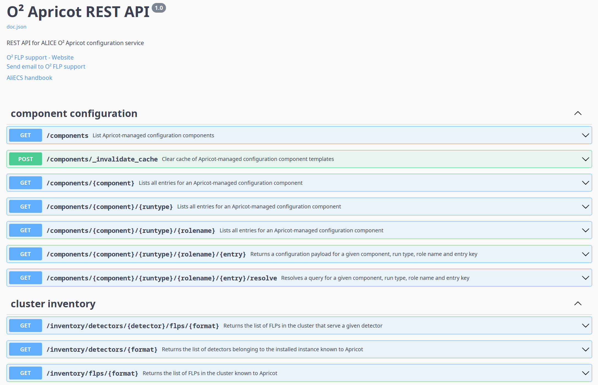

## apricot HTTP service

Web server component that implements the REST Configuration Endpoint (Apricot RCE). 

It serves JSON and/or plain text structures in order to make essential cluster information and component configuration available to scripts and other consumers for which the gRPC interface is impractical.

It is strictly **read-only** and only ever responds to `GET` (except for the special purpose `POST` call `/components/_invalidate_cache`, called only by Consul).

### Configuration

To use this feature, the `o2-apricot` running machine has to communicate with Consul via the `--backendUri` option (see [here](apricot.md)).

### Usage and options

The default port is `32188`.

To retrieve the information needed regarding FLPs, use the following urls in a web browser or with `curl` or `wget`.

To retrieve as plain text:

* `http://<apricot-host>:<port>/inventory/flps` or `http://<apricot-host>:<port>/inventory/flps/text`
* `http://<apricot-host>:<port>/inventory/detectors/<detector>/flps` or `http://<apricot-host>:<port>/inventory/detectors/<detector>/flps/text`

To retrieve as JSON:

* `http://<apricot-host>:<port>/inventory/flps/json`
* `http://<apricot-host>:<port>/inventory/detectors/<detector>/flps/json`

To retrieve a component configuration payload, use the following urls in a web browser or with `curl` or `wget`.

* `http://<apricot-host>:<port>/components/<component>/<runtype>/<rolename>/<entry>?process=true` - with template processing
* `http://<apricot-host>:<port>/components/<component>/<runtype>/<rolename>/<entry>?process=false` - without template processing, returns the entry verbatim

The full API documentation is available at `http://<apricot-host>:<port>/docs/` wherever your Apricot instance is running. It looks like this:

This documentation interface also allows to perform API calls directly from the browser.
Besides configuration retrieval, the API also includes calls for browsing the configuration tree and resolving payload paths to actual entries according to the `ANY/any` mechanism. 

### Examples

* With `curl`: `curl http://localhost:32188/inventory/flps`
* With `wget`: `wget http://localhost:32188/inventory/detectors/TST/flps/json -O ~/downloads/test`

Getting a template-processed configuration payload for a component (entry `tpc-full-qcmn` for component `qc`, with `list_of_detectors` and `run_type` passed as template variables):

* In a browser: `http://localhost:32188/components/qc/ANY/any/tpc-full-qcmn?process=true&list_of_detectors=tpc,its&run_type=PHYSICS`
* With `curl`: `curl http://127.0.0.1:32188/components/qc/ANY/any/tpc-full-qcmn\?process\=true\&list_of_detectors\=tpc,its\&run_type\=PHYSICS`
