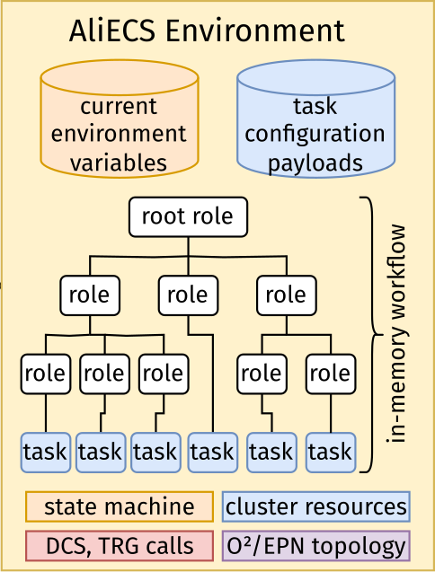

# Basic Concepts

From a logical point of view of data processing deployment and control, AliECS deals with concepts such as **environments**, **roles** and **tasks**, the understanding of which is paramount for using AliECS effectively.

    

## Tasks

The basic unit of scheduling in AliECS is a **task**. A task generally corresponds to a process. Sometimes this is a process that can receive and respond to OCC-compatible control messages (also called a **stateful task**), and other times this is simply a shell script or command line tool invocation (also called a **stateless task** or **basic task**).

## Workflows, roles and environments

All AliECS **workflows** are collections of tasks, which together form a coherent data processing chain.

Tasks are the leaves in a tree of roles.
A **role** is a runtime subdivision of the complete system, it represents a kind of operation along with its resources (but less than a complete data processing chain).
Each task implements one or more roles.
Roles allow binding tasks or groups of tasks to specific host attributes, detectors and configuration values.
Each role represents either a single task, or a group of child roles. While tasks are leaves, roles are all the other nodes in the control tree of an environment.

These novel, more flexible and more easily deployable abstractions represent the evolution of Run 2 abstractions such as ECS partitions.
In memory, a tree of O² roles, along with their tasks and their configuration is a **workflow**.
A workflow aggregates the collective state of its constituent O2 roles.
A running workflow, along with associated detectors and other hardware and software resources required for experiment operation constitutes an **environment**.

## Activities and runs

**Activity** and (data-taking) **run** are used interchangeably in AliECS.
Run is a term present in ALICE from the beginning, while activity was introduced in the early days of the O2 project when it was not clear how the idea of a run would evolve.

A run is a period of data taking, which is defined by a start and end time, typically lasting several hours at most.
It is identified by a run number, which is a monotonically increasing integer.
It is also associated with a set of configuration parameters, which are used to configure the data processing chain.

Run has also a second meaning at CERN, which is understood as a period of LHC operations, lasting a few years and separated by Long Shutdowns.
These operational runs are not to be mistaken with data-taking runs.
