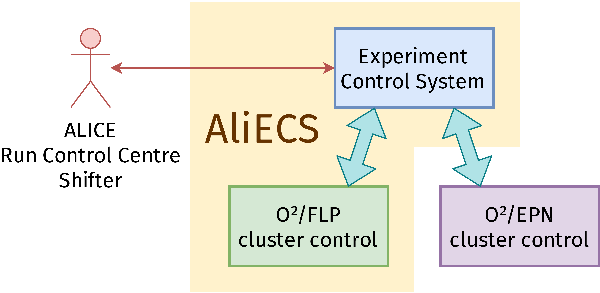

# Introduction

The ALICE Experiment Control System (**AliECS**) is a distributed system that combines state of the art cluster resource management and experiment control functionalities into a single comprehensive solution.

## The O²/FLP Computing Cluster

The primary production target of AliECS is the O²/FLP cluster, a subunit of the O² cluster.

AliECS is being developed as a complete solution for controlling all the synchronous data processing of the ALICE experiment during LHC Run 3.

Besides interfacing with the trigger system, the DCS (Detector Control System) and other O² components, AliECS keeps fine-grained control over the O²/FLP cluster, while delegating control of the O²/EPN cluster to a third party package.

