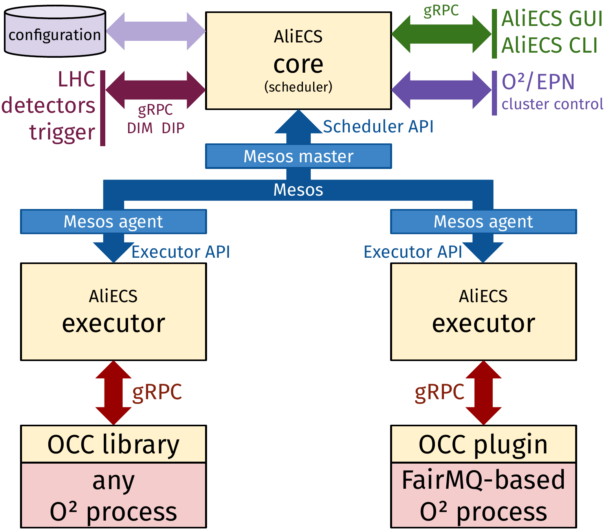
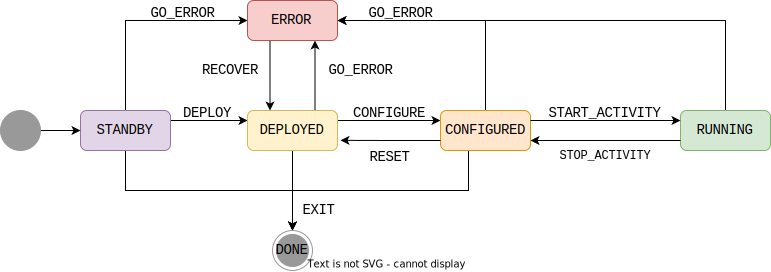

# Design Overview

AliECS is a distributed application, using Apache Mesos as toolkit. It integrates a task scheduler component, a purpose-built distributed state machine system, a multi-source stateful process configuration mechanism, and a control plugin and library compatible with any data-driven O2 process.

## AliECS Structure

| Component   | Description |
|-------------|-------------|
| core        | Main AliECS service and API entry point. Runs on the head node. Interfaces with the configuration system, the DCS, the trigger system and user interfaces. |
| executor    | Runs on every FLP node in the cluster. Started as needed by the AliECS core. An executor handles all the controlled processes of a given node. |
| OCC plugin  | FairMQ plugin that translates the FairMQ plugin interface (and state machine) into the O² Control and Configuration interface in order to interact with the executor. |
| OCC libary  | Equivalent of the OCC plugin, but for tasks that aren't based on FairMQ. Provides a task state machine and an O² Control and Configuration endpoint. |
| configuration | A Consul data store, running on the head node on port 8500. Used for AliECS configuration as well as application-specific component configuration. |
| Mesos master | Main service of the Mesos resource management system, running on the head node on port 5050. |
| Mesos agent  | Agent service of the Mesos RMS, running on every FLP. |
| AliECS GUI  | Instance of the user-facing web interface for AliECS (`cog`), running on the head node. This is the main entry point for regular users. |
| AliECS CLI  | The `coconut` command, provided by the package with the same name. This is the reference client for advanced users and developers. |

## Resource Management

Apache Mesos is a cluster resource management system. It greatly streamlines distributed application development by providing a unified distributed execution environment. Mesos facilitates the management of O²/FLP components, resources and tasks inside the O²/FLP facility, effectively enabling the developer to program against the datacenter (i.e., the O²/FLP facility at LHC Point 2) as if it was a single pool of resources.

For AliECS, Mesos acts as an authoritative source of knowledge on the state of the cluster, as well as providing transport facilities for communication between the AliECS core and the executor.

You can view the state of the cluster as presented by Mesos via the Mesos web interface, served on port `5050` of your head node when deployed via the O²/FLP Suite setup tool.

## FairMQ

The O² project has chosen FairMQ as the common message passing and data transport framework for its data-driven processes. It has been developed in the context of FairRoot, a simulation, reconstruction and analysis framework for particle physics experiments. FairMQ provides the basic building blocks to implement complex data processing workflows, including a message queue, a configuration mechanism, a state machine, and a plugin system.

Thus, when we discuss the state machine of an AliECS-controlled process, we usually refer to the [FairMQ state machine](https://github.com/FairRootGroup/FairMQ/blob/master/docs/Device.md#13-state-machine).

## State machines

The main state machine of AliECS is the environment state machine, which represents the collective state of all the tasks involved in a given data processing activity.

While FairMQ devices use their own, FairMQ-specific state machine, non-FairMQ tasks based on the [OCC library](/occ/README.md) use the same state machine as the AliECS environment state machine, the only difference being that the `START_ACTIVITY` transition is simply `START`, and the `STOP_ACTIVITY` transition is simply `STOP`.
