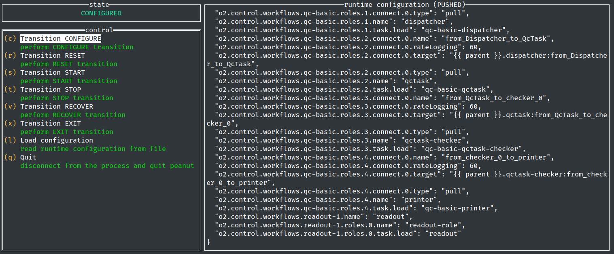

# O² Control and Configuration

## Build
Starting from the `occ` directory.

```bash
$ mkdir build && cd build
$ cmake .. -DCMAKE_BUILD_TYPE=Debug -DFAIRMQPATH=<path to FairMQ prefix> -DFAIRLOGGERPATH=<path to FairLogger prefix>
$ make
```

It can also be built via aliBuild (package `Control-OCCPlugin`).

## Run example
From build dir:
```bash
$ occlib/examples/dummy-process/occexample-dummy-process
```
or
```bash
$ occlib/examples/dummy-process/occexample-dummy-process --control-port <some port>
```
or
```bash
$ OCC_CONTROL_PORT=<some port> occlib/examples/dummy-process/occexample-dummy-process
```

The dummy process now waits for control commands.

## Single process control with `peanut`

`peanut` is the Process Execution And coNtrol UTility for OCClib-based O² processes. Its purpose
is to be a debugging and development aid for non-FairMQ O² devices, where FairMQ's interactive
controller is not available.

In aliBuild it is part of the Control-core package.

`peanut` can connect to a running OCClib-based process, query its status, drive its state machine
and push runtime configuration data.

Peanut is an interactive tool, the only information it picks up from its environment is the
`OCC_CONTROL_PORT` variable, which is used to connect to a running OCClib-based process.

```bash
$ OCC_CONTROL_PORT=<some port> peanut
```



Peanut commands are documented inline. Each transition is applied immediately and
the state is updated in real time.

Compared to the raw gRPC API, the following limitations apply:
* It is not possible to perform a `GO_ERROR` transition, as this transition is only triggered from
user code.
* The `CONFIGURE` transition may be triggered both with and without runtime configuration data, which
may or may not be suitable depending on user code. All other transitions send no payload.

The last two commands are **not** transitions:
* `Load configuration` allows the user to read in a JSON or YAML file containing sample
configuration data that is then available to be pushed to the controlled process during a future
`CONFIGURE` transition. On startup, there is no file loaded, so a `CONFIGURE` transition will push
an empty payload. Once a runtime configuration file is loaded, its title bar reports `NOT PUSHED`
until the next `CONFIGURE` transition, at which point it becomes `PUSHED`.
* `Quit` disconnects from the controlled process and quits `peanut`, but it performs no transitions
or other data exchange with the controlled process. A future instance of `peanut` may reattach itself
to the same process and continue from there.

## OCC API debugging with `grpcc`

We can send gRPC-based OCC commands manually with an interactive gRPC client
like [`grpcc`](https://github.com/njpatel/grpcc):
```bash
$ sudo yum install http-parser nodejs npm
$ npm install -g grpcc
```

In a new terminal, we go to the `occ` directory (not the `build` dir) and connect via gRPC:
```bash
$ grpcc -i --proto protos/occ.proto --address 127.0.0.1:47100
```

If all went well, we get an interactive environment like so:
```

Connecting to occ_pb.Occ on 127.0.0.1:47100. Available globals:

  client - the client connection to Occ
    stateStream (StateStreamRequest, callback) returns StateStreamReply
    getState (GetStateRequest, callback) returns GetStateReply
    transition (TransitionRequest, callback) returns TransitionReply

  printReply - function to easily print a unary call reply (alias: pr)
  streamReply - function to easily print stream call replies (alias: sr)
  createMetadata - convert JS objects into grpc metadata instances (alias: cm)
  printMetadata - function to easily print a unary call's metadata (alias: pm)

Occ@127.0.0.1:47100>
```

Let's try to send some commands. State changes will be reported in the standard output of the process.
```
Occ@127.0.0.1:47100> client.getState({}, pr)
{
  "state": "STANDBY"
}
Occ@127.0.0.1:47100> client.transition({srcState:"STANDBY", transitionEvent:"CONFIGURE", arguments:[]}, pr)
{
  "trigger": "EXECUTOR",
  "state": "CONFIGURED",
  "transitionEvent": "CONFIGURE",
  "ok": true
}
Occ@127.0.0.1:47100> client.getState({}, pr)
{
  "state": "CONFIGURED"
}
Occ@127.0.0.1:47100> client.transition({srcState:"CONFIGURED", transitionEvent:"START", arguments:[]}, pr)
{
  "trigger": "EXECUTOR",
  "state": "RUNNING",
  "transitionEvent": "START",
  "ok": true
}
Occ@127.0.0.1:47100> client.transition({srcState:"RUNNING", transitionEvent:"STOP", arguments:[]}, pr)
{
  "trigger": "EXECUTOR",
  "state": "CONFIGURED",
  "transitionEvent": "STOP",
  "ok": true
}
Occ@127.0.0.1:47100> client.transition({srcState:"CONFIGURED", transitionEvent:"EXIT", arguments:[]}, pr)
{
  "trigger": "EXECUTOR",
  "state": "DONE",
  "transitionEvent": "EXIT",
  "ok": true
}
# no further commands possible, EXIT stops the process
```

## Developer reference
1. Build & install the OCC library either manually or via aliBuild (`Control-OCCPlugin`);
2. check out [the dummy process example](occlib/examples/dummy-process) and [its entry point](occlib/examples/dummy-process/main.cxx) and to see how to instantiate OCC;
3. implement interface at [`occlib/RuntimeControlledObject.h`](occlib/RuntimeControlledObject.h),
4. link your non-FairMQ O² process against the target `AliceO2::Occ` as described in [the dummy process README](occlib/examples/dummy-process/README.md#standalone-build).
