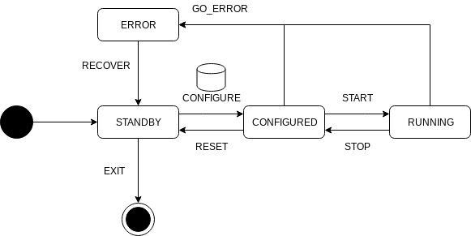

# O² Control and Configuration Components

The O² Control and Configuration (OCC) interface is the bidirectional intermediary between AliECS and all stateful controlled processes.

For FairMQ devices, the OCC interface is implemented by the OCCLite Plugin (default) and previously by the OCC Plugin (deprecated). The OCCLite plugin interfaces with the FairMQ plugin system, therefore no user code changes are necessary to make a FairMQ device compatible with AliECS.

For stateful tasks that do not use FairMQ, the OCC interface is implemented by the OCC library (OCClib). The task implementor who wishes to make use of AliECS must link against OCClib and implement the `RuntimeControlledObject` C++ interface.

## Developer quick start instructions for OCClib

1. Build & install the OCC library either manually or via aliBuild (`Control-OCCPlugin`);
2. check out [the dummy process example](occlib/examples/dummy-process) and [its entry point](occlib/examples/dummy-process/main.cxx) and to see how to instantiate OCC;
3. implement interface at [`occlib/RuntimeControlledObject.h`](occlib/RuntimeControlledObject.h),
4. link your non-FairMQ O² process against the target `AliceO2::Occ` as described in [the dummy process README](occlib/examples/dummy-process/README.md#standalone-build).

## Manual build instructions
Starting from the `occ` directory.

```bash
$ mkdir build && cd build
$ cmake .. -DCMAKE_BUILD_TYPE=Debug -DFAIRMQPATH=<path to FairMQ prefix> -DFAIRLOGGERPATH=<path to FairLogger prefix>
$ make
```

It can also be built via aliBuild (package `Control-OCCPlugin`).

## Run example
From build dir:
```bash
$ occlib/examples/dummy-process/occexample-dummy-process
```
or
```bash
$ occlib/examples/dummy-process/occexample-dummy-process --control-port <some port>
```
or
```bash
$ OCC_CONTROL_PORT=<some port> occlib/examples/dummy-process/occexample-dummy-process
```

The dummy process now waits for control commands.

## The OCC state machine

The figure below describes the OCC state machine, as implemented in the OCC library and exposed
by the OCC API for non-FairMQ devices (`controlmode.DIRECT`).



Note: a PAUSED state with events PAUSE/RESUME is foreseen but not used yet.

## Single process control with `peanut`

See [`peanut` Overview](peanut/README.md).

## OCC API debugging with `grpcc`

See [OCC API debugging with `grpcc`](/docs/using_grpcc_occ.md).