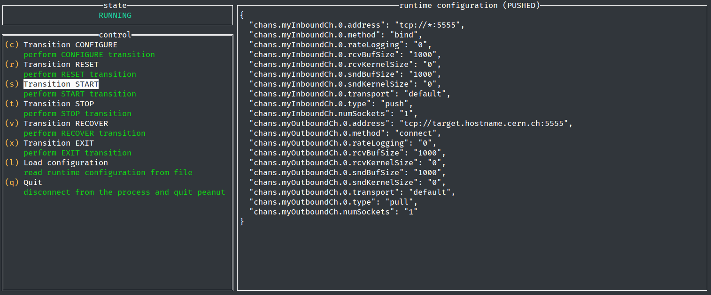

# Process control and execution utility overview

`peanut` is the **p**rocess **e**xecution **a**nd co**n**trol **ut**ility for OCClib-based O² processes. Its purpose
is to be a debugging and development aid for non-FairMQ O² devices, where FairMQ's interactive
controller is not available.

In aliBuild it is part of the `coconut` package.

`peanut` can connect to a running OCClib-based process, query its status, drive its state machine
and push runtime configuration data.

`peanut` is an interactive tool, the only information it picks up from its environment is the
`OCC_CONTROL_PORT` variable, which is used to connect to a running OCClib-based process.

```bash
$ OCC_CONTROL_PORT=<some port> peanut
```



`peanut` commands are documented inline. Each transition is applied immediately and
the state is updated in real time.

Compared to the raw gRPC API, the following limitations apply:

* It is not possible to perform a `GO_ERROR` transition, as this transition is only triggered from
user code.

* The `CONFIGURE` transition may be triggered both with and without runtime configuration data, which
may or may not be suitable depending on user code. All other transitions send no payload.

The last two commands are **not** transitions:

* `Load configuration` allows the user to read in a JSON or YAML file containing sample
configuration data that is then available to be pushed to the controlled process during a future
`CONFIGURE` transition. On startup, there is no file loaded, so a `CONFIGURE` transition will push
an empty payload. Once a runtime configuration file is loaded, its title bar reports `NOT PUSHED`
until the next `CONFIGURE` transition, at which point it becomes `PUSHED`.

* `Quit` disconnects from the controlled process and quits `peanut`, but it performs no transitions
or other data exchange with the controlled process. A future instance of `peanut` may reattach itself
to the same process and continue from there.
