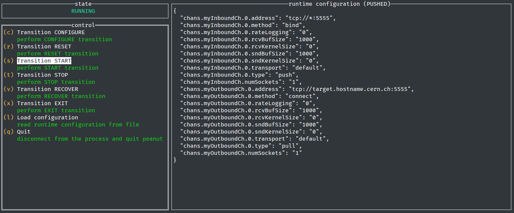

# Process control and execution utility overview

`peanut` is the **p**rocess **e**xecution **a**nd co**n**trol **ut**ility for OCClib-based O² processes. Its purpose
is to be a debugging and development aid for OCC-based and FairMQ O² devices.

In aliBuild it is part of the `coconut` package.

`peanut` can connect to a running OCClib-based or FairMQ process, query its status, drive its state machine
and push runtime configuration data.

`peanut` runs in two modes depending on whether a command is passed:

* **TUI mode** — interactive terminal UI (launched when no command is given)
* **CLI mode** — non-interactive, scriptable (launched when a command is given)

---

## TUI mode



```bash
peanut [flags]
```

| Flag | Default | Description |
|------|---------|-------------|
| `-addr` | `""` | gRPC address `host:port`; if empty, falls back to `OCC_CONTROL_PORT` env var (direct mode only) |
| `-mode` | `direct` | `direct`, `fmq`, or `fmq-step` (see below) |

### Modes

#### `direct` — OCC protobuf (default)

Connects to an OCClib-based process using the standard OCC protobuf codec.
The state machine operates on OCC states: `STANDBY`, `CONFIGURED`, `RUNNING`, `ERROR`.

```bash
OCC_CONTROL_PORT=47100 peanut
# or
peanut -addr localhost:47100 -mode direct
```

Control buttons: **CONFIGURE**, **RESET**, **START**, **STOP**, **RECOVER**, **EXIT**

#### `fmq` — FairMQ JSON codec with automatic multi-step sequencing

Connects to a FairMQ device using the JSON codec. Each OCC-level button press
automatically drives the full underlying FairMQ state machine sequence.
The state is displayed as an OCC-mapped state (`STANDBY`, `CONFIGURED`, `RUNNING`…).

```bash
peanut -addr localhost:47100 -mode fmq
```

Control buttons: **CONFIGURE**, **RESET**, **START**, **STOP**, **RECOVER**, **EXIT**

Sequences driven automatically:

| Button | FairMQ steps |
|--------|-------------|
| CONFIGURE | INIT DEVICE → COMPLETE INIT → BIND → CONNECT → INIT TASK |
| RESET | RESET TASK → RESET DEVICE |
| START | RUN |
| STOP | STOP |
| RECOVER | RESET DEVICE (from ERROR) |
| EXIT | RESET (if needed) → END |

#### `fmq-step` — FairMQ JSON codec with granular per-step control

Connects to a FairMQ device using the JSON codec. Exposes each individual FairMQ
state machine step as a separate button. The state is displayed as the raw FairMQ state.

```bash
peanut -addr localhost:47100 -mode fmq-step
```

| Key | Button | Transition |
|-----|--------|-----------|
| `1` | INIT DEVICE | IDLE → INITIALIZING DEVICE |
| `2` | COMPLETE INIT | INITIALIZING DEVICE → INITIALIZED |
| `3` | BIND | INITIALIZED → BOUND |
| `4` | CONNECT | BOUND → DEVICE READY |
| `5` | INIT TASK | DEVICE READY → READY |
| `6` | RUN | READY → RUNNING |
| `7` | STOP | RUNNING → READY |
| `8` | RESET TASK | READY → DEVICE READY |
| `9` | RESET DEVICE | → IDLE |
| `0` | END | IDLE → EXITING |

### Common TUI controls (all modes)

| Key | Action |
|-----|--------|
| `n` | **Reconnect** — re-establish the gRPC connection to the controlled process. Use this when the process has been restarted after a crash or deliberate termination. |
| `l` | **Load configuration** — open a file dialog to read a YAML or JSON configuration file. The path field supports tab-completion. Once loaded, the right panel shows `NOT PUSHED` until the next CONFIGURE transition, then `PUSHED`. |
| `q` | **Quit** — disconnect and exit without sending any transitions. |

### Connection monitoring

While connected, peanut passively monitors the gRPC connection in a background goroutine and detects process termination without any button press. The strategy depends on what the controlled process supports:

1. **StateStream** (OCClib processes, `direct` mode) — subscribes to the state stream; any disconnect immediately triggers `UNREACHABLE` and an error modal. State updates from the stream are also reflected in the display in real time.
2. **EventStream** (FairMQ processes, `fmq`/`fmq-step` modes) — subscribes to the event stream; disconnect is detected immediately when the stream breaks.
3. **Polling** (fallback) — if neither stream is available, `GetState` is polled every 2 seconds.

When the process dies, the state display shows `UNREACHABLE` and an error modal appears. After restarting the controlled process, press `n` to reconnect.

### Runtime configuration files

Configuration files are YAML or JSON, with arbitrarily nested structure.
`peanut` flattens them to dot-notation key=value pairs before pushing.
Integer map keys and integer values are both handled correctly.

Example (channel configuration):

```yaml
chans:
  data:
    numSockets: 1
    0:
      address: ipc://@o2ipc-example
      method: bind
      type: push
      transport: shmem
      sndBufSize: 1000
      rcvBufSize: 1000
      sndKernelSize: 0
      rcvKernelSize: 0
      rateLogging: 0
```

This flattens to entries like `chans.data.0.address=ipc://@o2ipc-example`.

---

## CLI mode

```bash
peanut [flags] <command> [args]
```

| Flag | Default | Description |
|------|---------|-------------|
| `-addr` | `localhost:47100` | gRPC address `host:port` |
| `-mode` | `fmq` | `fmq` (JSON codec) or `direct` (protobuf) |
| `-timeout` | `30s` | timeout for unary gRPC calls |
| `-config` | `""` | path to YAML/JSON file; flattened key=value pairs are sent as arguments. Inline `key=val` arguments take precedence. |

### Commands

#### `get-state`

Print the current FSM state.

```bash
peanut -addr localhost:47100 get-state
```

#### `transition <fromState> <toState> [key=val ...]`

High-level state transition. In `fmq` mode drives the full multi-step FairMQ sequence automatically.

```bash
# FairMQ: drive full configure sequence
peanut -addr localhost:47100 -mode fmq transition STANDBY CONFIGURED \
  chans.data.0.address=ipc://@o2ipc-example

# FairMQ: with config file
peanut -addr localhost:47100 -mode fmq -config stfsender-configure-args.yaml \
  transition STANDBY CONFIGURED

# Direct OCC
peanut -addr localhost:47100 -mode direct transition STANDBY CONFIGURED
```

FairMQ sequences driven automatically:

| From → To | Steps |
|-----------|-------|
| `STANDBY → CONFIGURED` | INIT DEVICE, COMPLETE INIT, BIND, CONNECT, INIT TASK |
| `CONFIGURED → RUNNING` | RUN |
| `RUNNING → CONFIGURED` | STOP |
| `CONFIGURED → STANDBY` | RESET TASK, RESET DEVICE |

#### `direct-step <srcState> <event> [key=val ...]`

Low-level: send a single raw OCC gRPC Transition call (protobuf codec).

```bash
peanut -addr localhost:47100 -mode direct direct-step STANDBY CONFIGURE key=val
```

Events: `CONFIGURE`, `RESET`, `START`, `STOP`, `RECOVER`, `EXIT`

#### `fmq-step <srcFMQState> <fmqEvent> [key=val ...]`

Low-level: send a single raw FairMQ gRPC Transition call (JSON codec).
State/event names that contain spaces must be quoted.

```bash
peanut -addr localhost:47100 fmq-step IDLE "INIT DEVICE" chans.x.0.address=ipc://@foo
peanut -addr localhost:47100 fmq-step READY RUN
```

#### `state-stream`

Subscribe to `StateStream` and print state updates until interrupted (Ctrl-C).

```bash
peanut -addr localhost:47100 state-stream
```

#### `event-stream`

Subscribe to `EventStream` and print events until interrupted (Ctrl-C).

```bash
peanut -addr localhost:47100 event-stream
```

---

## Limitations

* The `GO_ERROR` transition cannot be triggered from `peanut`, as it is only triggered from user code inside the controlled process.
* `Quit` / `q` disconnects without sending any transition. A future instance of `peanut` can reattach to the same process and continue.
